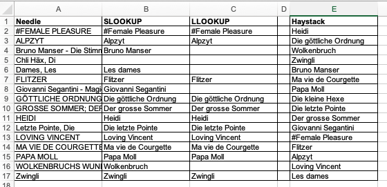

# SLOOKUP and LLOOKUP for Excel
 Functions to lookup for similar values

Excel has the LOOKUP, HLOOKUP, VLOOKUP and XLOOKUP function to search for values in other ranges, but they need exact matches. XLOOKUP allows for well defined substrings with wildcard characters, but does not deal random changes. The functions proposed here allow you to do this. Two functions are proposed:

LLOOKUP uses Levenshtein which has a complexity of O(n^2).
SLOOKUP uses simpleSim which has a complexity of O(n) in best and random cases and O(n^2) in worst case, so it may be faster on larger ranges.
Both scan the entire list, so if you use them in a range, the complexity is O(needles * haystacks)

 LLOOKUP(needle, haystack, result, optional threshold = 0.75, optional partialstring = true, optional simplestring = true)
 Finds the best match for needle in the haystack range and returns the corresponding item in the result range using the Levensthein similarity
 Needle is interpreted as string.
 Haystack and result must be ranges with a single column and equal number of rows.
 Haystack can be of any order, but the search stops at an empty cell, if the range is the entire column (eg. A:A)
 Threshold fine tunes the sensitivity (for values between 0 and 1). If the score of no value in haystack exceeds threshold, the result is empty.
 Partialstring looks for asymetric matches where needle is included in haystack but the haystack not in needle
 Simplestring uses URL-representation of the needle and the haystack (all lowercase, no special characters)

 SLOOKUP(needle, haystack, result, optional threshold = 0.75, optional partialstring = true, optional simplestring = true)
 Finds the best match for needle in the haystack range and returns the corresponding item in the result range using the simpleSim similarity
 Needle is interpreted as string.
 Haystack and result must be ranges with a single column and equal number of rows.
 Haystack can be of any order, but the search stops at an empty cell, if the range is the entire column (eg. A:A)
 Threshold fine tunes the sensitivity (for values between 0 and 1). If the score of no value in haystack exceeds threshold, the result is empty.
 Partialstring looks for asymetric matches where needle is included in haystack but the haystack not in needle
 Simplestring uses URL-representation of the needle and the haystack (all lowercase, no special characters)

 LevenshteinDistance(needle, haystack, optional partialstring = true, optional simplestring = true)
 Calculates the edit distance of needle and haystack.
 Partialstring looks for asymetric matches where needle is included in haystack but the haystack not in needle
 Simplestring uses URL-representation of the needle and the haystack (all lowercase, no special characters)

 LevenshteinSimilarity(needle, haystack, optional partialstring = true, optional simplestring = true)
 Calculates the edit distance of needle and haystack as a similarity measure (0 not similar, 1 identical)
 Partialstring looks for asymetric matches where needle is included in haystack but the haystack not in needle
 Simplestring uses URL-representation of the needle and the haystack (all lowercase, no special characters)

 SimpleSimilarity(needle, haystack, result, optional partialstring = true, optional simplestring = true)
 Calculates the similarity of needle with haystack between 0 (not at all similar) and 1 (identical) based on custom algorithm
 Partialstring looks for asymetric matches where needle is included in haystack but the haystack not in needle
 Simplestring uses URL-representation of the needle and the haystack (all lowercase, no special characters)

 SimpleURL(text)
 Converts a text to an URL-compatible form (all lowercase and all non-alphanumeric characters replaced by "-")

 The functions do not have side effects

## Version 1.1
After the episode with DeepSeek (https://belle-nuit.com/how-deepseek-explained-the-simplesim-algorithm-and-found-an-oddity-in-it), the algorithm of SimpleSim has been improved. It searches now also backwards and retains the distance to the target offset if it is nearer. The function can also exit early if a certain defined threshold has not been achieved.

The algorithm can be described as following:

- The score is set to 0.
- The offset is set to 1
- The position is set to 0
- The first character of needle is compared to the characters in the haystack starting at offset
- If a match is found, the position is set to the position of the character in the haystack
- A search back starting from offset-2 to the beginning is executed 
- If a match is found and the position is nearer to offset, that position is retained.
- If position is found, the score is augmented by 1/(abs(position-offset) + 1), means 1 for continous text and less in other cases
- If there is a threshold and it is clear that the threshold cannot be achieved, the procedure is stopped early.
- The procedure is repeated for each character in the needle
- The result is the score divided by the length of the needle

 MIT License
 
 Version 1.1 2025-02-14
 
 Version 1.0 2024-06-14
 
 Author: matti@belle-nuit.com 2024
 

